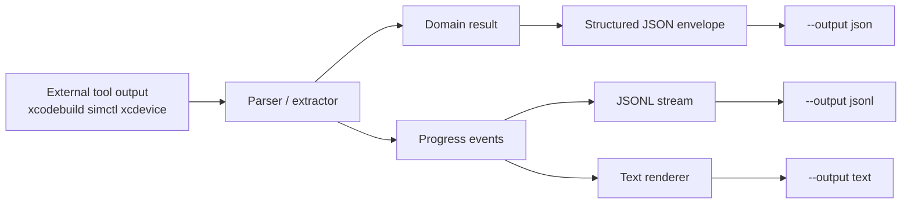
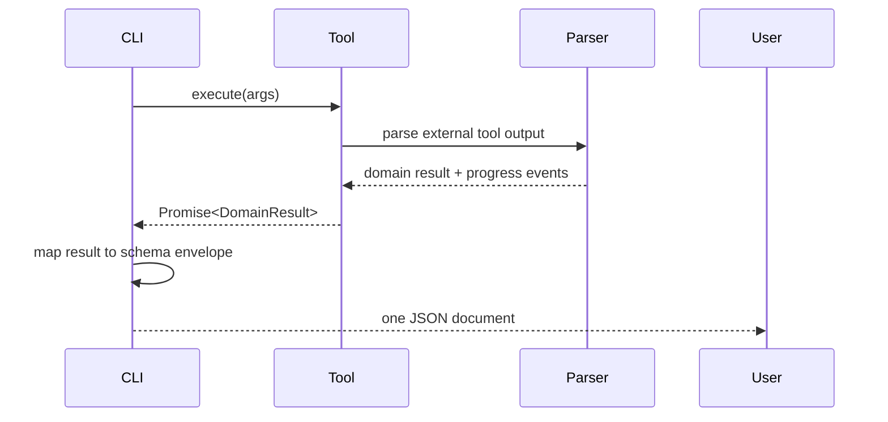
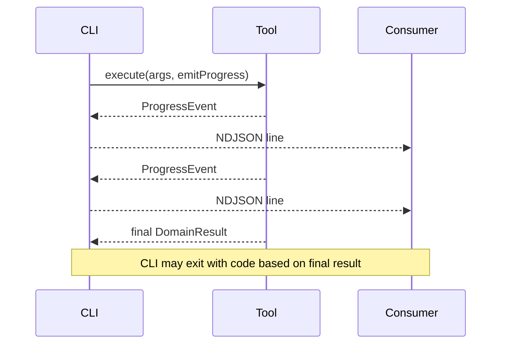
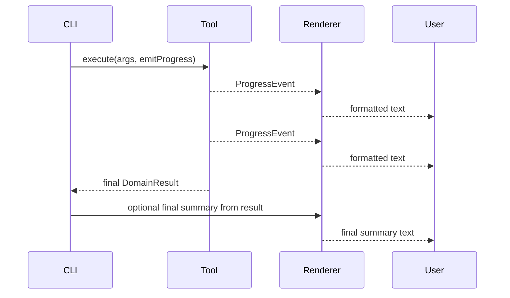
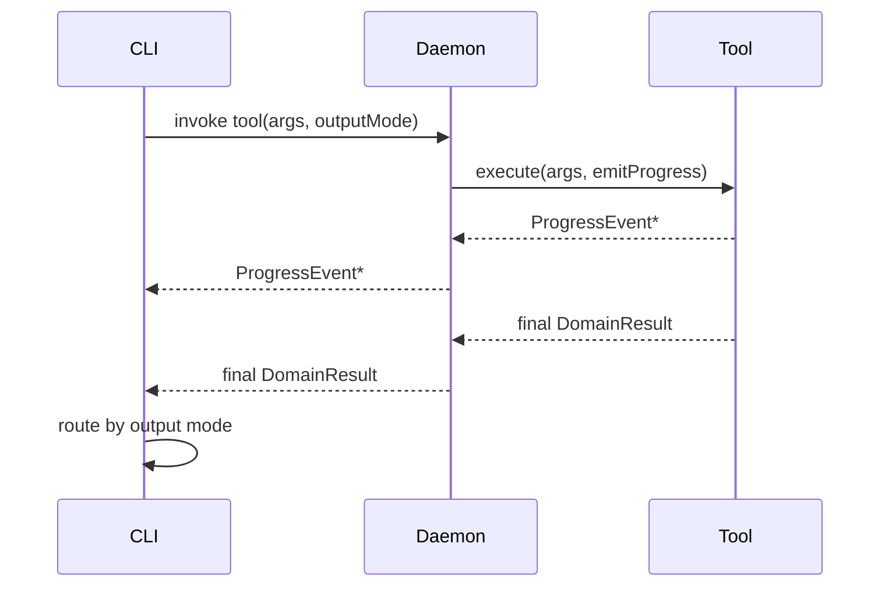
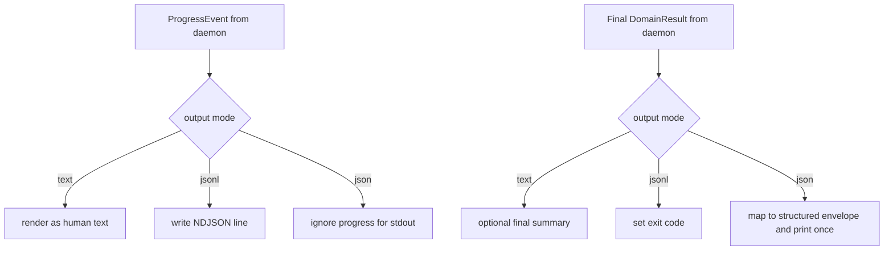
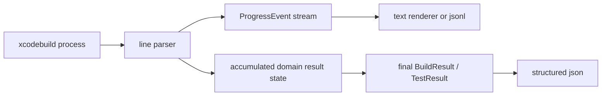
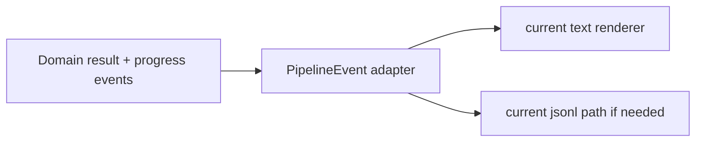
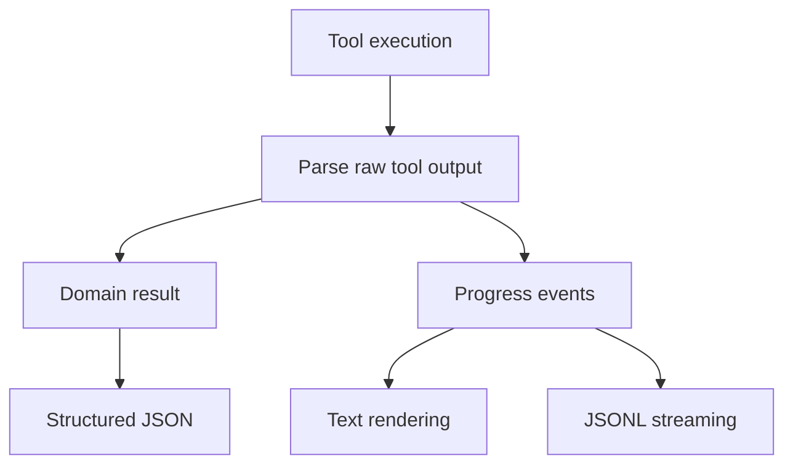

# Domain Result Output Architecture

## Goal

Move to a model where:

- tools produce **domain results** first
- progress streaming is a separate concern
- `json` returns the final structured result
- `jsonl` streams machine-readable progress events
- `text` renders the same progress stream for humans
- existing snapshot fixtures remain the source of truth during the refactor

## Core idea

Separate these concerns explicitly:

1. **Domain result**
   - final machine-readable tool outcome
2. **Progress stream**
   - realtime machine-readable progress events
3. **Presentation**
   - text rendering from the progress stream

`PipelineEvent` should stop being the canonical result model.
It should become a downstream progress or presentation transport, or be replaced by a cleaner progress-event model over time.

## High-level model



## Why this is better

- no back-parsing rendered text into JSON
- no treating UI-shaped events as canonical data
- clean separation between final result and live progress
- JSON becomes a first-class output, not a renderer hack
- text and jsonl keep realtime behavior for long-running tools

---

# Core types

## Domain result

A tool family should produce a result type that represents the final outcome.

```ts
export interface ToolDomainResultBase {
  kind: string;
  didError: boolean;
  error: string | null;
}

export interface SimulatorListResult extends ToolDomainResultBase {
  kind: 'simulator-list';
  simulators: Array<{
    simulatorId: string;
    name: string;
    runtime: string;
    state: string;
    isAvailable: boolean;
  }>;
}

export interface LaunchResult extends ToolDomainResultBase {
  kind: 'launch-result';
  summary: { status: 'SUCCEEDED' | 'FAILED' };
  artifacts: {
    bundleId?: string;
    simulatorId?: string;
    deviceId?: string;
    processId?: number;
    appPath?: string;
    runtimeLogPath?: string;
    osLogPath?: string;
  };
  diagnostics: {
    warnings: string[];
    errors: string[];
  };
}
```

## Progress event

Progress events are for live updates, not final canonical data.

```ts
export type ProgressEvent =
  | {
      type: 'status';
      level: 'info' | 'warning' | 'error';
      message: string;
    }
  | {
      type: 'xcodebuild-line';
      stream: 'stdout' | 'stderr';
      line: string;
    }
  | {
      type: 'table';
      name: string;
      columns: string[];
      rows: Array<Record<string, string>>;
    }
  | {
      type: 'artifact';
      name: string;
      path: string;
    };
```

## Structured JSON envelope

```ts
export interface StructuredOutputEnvelope<TData> {
  schema: string;
  schemaVersion: string;
  didError: boolean;
  error: string | null;
  data: TData | null;
}
```

---

# Execution model

## Tool contract

Tools should produce:

- a final domain result
- zero or more progress events while running

```ts
export interface ToolExecutionContext {
  emitProgress(event: ProgressEvent): void;
  attach?(image: { path: string; mimeType: string }): void;
}

export type ToolExecutor<TArgs, TResult> = (
  args: TArgs,
  ctx: ToolExecutionContext,
) => Promise<TResult>;
```

## Example

```ts
const listSimulators: ToolExecutor<ListSimArgs, SimulatorListResult> = async (
  args,
  ctx,
) => {
  ctx.emitProgress({
    type: 'status',
    level: 'info',
    message: 'Querying simulators',
  });

  const simulators = await fetchSimulators(args);

  ctx.emitProgress({
    type: 'table',
    name: 'simulators',
    columns: ['name', 'runtime', 'state'],
    rows: simulators.map((sim) => ({
      name: sim.name,
      runtime: sim.runtime,
      state: sim.state,
    })),
  });

  return {
    kind: 'simulator-list',
    didError: false,
    error: null,
    simulators,
  };
};
```

---

# CLI flows

## `--output json`

Return the final structured result only.



### Example

```ts
const result = await executeTool(args, progressSink);
const envelope = toStructuredEnvelope(result);
process.stdout.write(`${JSON.stringify(envelope, null, 2)}\n`);
```

### Output example

```json
{
  "schema": "xcodebuildmcp.output.simulator-list",
  "schemaVersion": "1",
  "didError": false,
  "error": null,
  "data": {
    "simulators": [
      {
        "simulatorId": "SIM-123",
        "name": "iPhone 16",
        "runtime": "iOS 18.0",
        "state": "Booted",
        "isAvailable": true
      }
    ]
  }
}
```

## `--output jsonl`

Stream progress events as NDJSON.



### Example

```ts
const progressSink = (event: ProgressEvent) => {
  process.stdout.write(`${JSON.stringify(event)}\n`);
};

const result = await executeTool(args, { emitProgress: progressSink });
process.exitCode = result.didError ? 1 : 0;
```

### Output example

```json
{"type":"status","level":"info","message":"Querying simulators"}
{"type":"table","name":"simulators","columns":["name","runtime","state"],"rows":[{"name":"iPhone 16","runtime":"iOS 18.0","state":"Booted"}]}
```

## `--output text`

Render the progress stream for humans.



### Example

```ts
const renderer = createCliTextRenderer();

const result = await executeTool(args, {
  emitProgress(event) {
    renderer.render(event);
  },
});

renderer.finish(result);
process.exitCode = result.didError ? 1 : 0;
```

## `--output raw`

No design change proposed here.

---

# Daemon / CLI split

## Current problem

Today the daemon boundary primarily carries `PipelineEvent`s.
That makes progress or presentation data the main contract across the boundary.

## Proposed model

The daemon boundary should carry:

1. **progress stream** for realtime output
2. **final domain result** for canonical machine-readable output

## End-state daemon flow



## CLI routing after daemon response



## Suggested protocol shape

```ts
export type DaemonToolMessage =
  | {
      kind: 'progress';
      event: ProgressEvent;
    }
  | {
      kind: 'result';
      result: ToolDomainResultBase;
    };
```

This is better than using progress events as the only returned artifact.

---

# Long-running xcodebuild tools

These tools need both:

- live progress streaming
- a final structured result

That means they should not be forced into a buffered-only model.

## Flow



## Example

```ts
const buildTool: ToolExecutor<BuildArgs, BuildResult> = async (args, ctx) => {
  const state = createBuildState();

  await runXcodebuild(args, {
    onLine(line, stream) {
      ctx.emitProgress({ type: 'xcodebuild-line', stream, line });
      updateBuildStateFromLine(state, line);
    },
  });

  return finalizeBuildResult(state);
};
```

This preserves the clanky TTY behavior without making text rendering the canonical model.

---

# Relationship to existing fixtures

## TDD rule

The existing snapshot fixtures remain the source of truth during the refactor.

That means:

- text fixtures must continue to pass unchanged
- json fixtures define the final structured result contracts
- jsonl behavior should be validated as a progress stream, not confused with final result shape

## Transitional compatibility

During migration, `PipelineEvent` can continue to exist as an adapter target:



This lets us preserve behavior while we demote `PipelineEvent` from canonical status.

---

# Migration plan

## Phase 1

Introduce domain result types and progress-event types for the main tool families:

- list results
- app-path / bundle-id
- launch / install / stop
- build / build-and-run / test

## Phase 2

Refactor tools so they:

- return domain results
- emit progress events during execution

## Phase 3

Adapt outputs:

- `json` from domain results
- `jsonl` from progress events
- `text` from progress-event rendering

## Phase 4

Keep `PipelineEvent` only as a compatibility adapter for legacy rendering code until it can be removed or renamed.

## Phase 5

Once the renderer stack is fully moved over, either:

- remove `PipelineEvent`, or
- rename it to something honest like `ProgressEvent` or `RenderEvent`

---

# Recommended naming

If we keep the current concept, I would steer toward:

- `ToolDomainResult`
- `ProgressEvent`
- `StructuredOutputEnvelope`
- `ProgressRenderer`

I would avoid treating `PipelineEvent` as the core abstraction in new code.

---

# Final recommendation

Use this architecture:



In plain terms:

- `json` is the final domain result
- `jsonl` is the machine-readable progress stream
- `text` is the human rendering of that same progress stream
- domain data comes first
- presentation comes second
