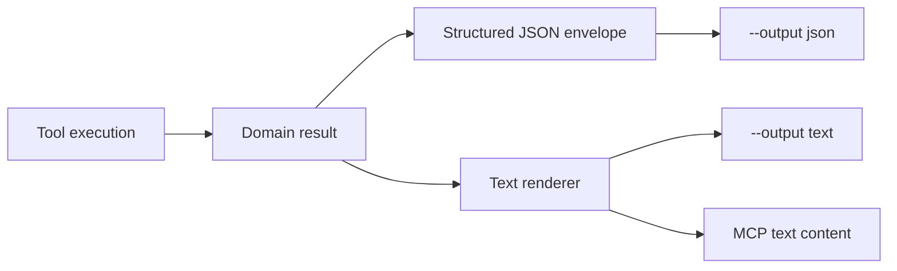
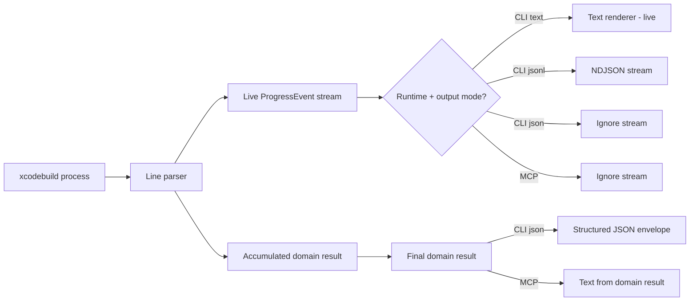
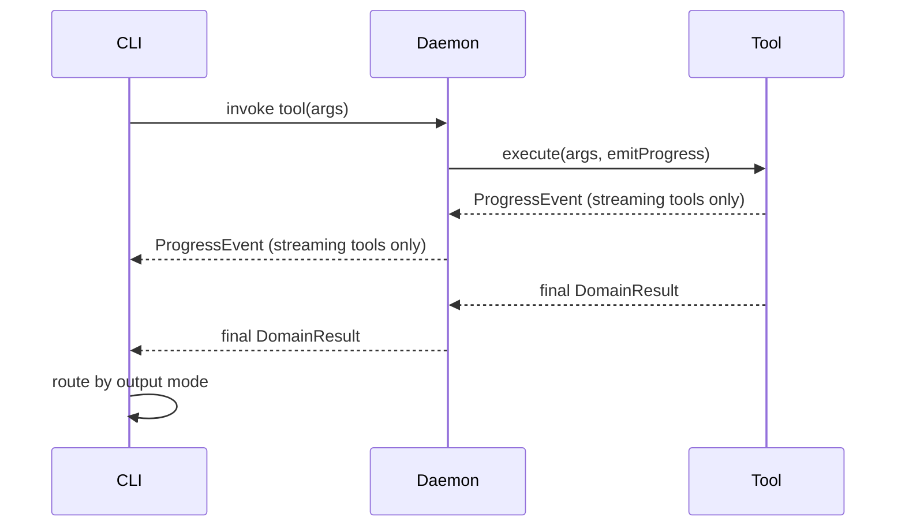

# Domain Result Output Architecture

## Goal

Tools produce **domain results** as the canonical output. Rendering is derived from domain results for non-streaming tools, and from a live progress stream for streaming tools. The two paths never overlap.

- `json` returns the final structured result (all tools)
- `jsonl` streams machine-readable progress events (streaming tools only)
- `text` renders from the domain result OR from the live progress stream depending on tool type
- existing snapshot fixtures remain the source of truth

## Core idea

Tools fall into two categories:

1. **Non-streaming tools** (majority: list, install, launch, stop, discover, etc.)
   - Run to completion, return a domain result
   - Domain result is the **sole source of truth** for all output modes
   - No progress events emitted during execution

2. **Streaming tools** (xcodebuild-based: build, build-run, test)
   - Emit progress events during long-running execution
   - Return a domain result when complete
   - Live streaming only happens for **CLI text** and **CLI jsonl**
   - All other runtimes/modes render from the domain result

## High-level model

### Non-streaming tools



### Streaming tools



## Why this is better

- No dual-path rendering — each tool category has one source of truth
- No back-parsing rendered text into JSON
- No filtering/deduplication hacks between live stream and domain result
- JSON is always from the domain result
- Text output is either from the domain result OR the live stream, never both
- Streaming tools get real-time output for CLI users without compromising structured output

---

# Core types

## Domain result

A tool family produces a result type that represents the final outcome.

```ts
export interface ToolDomainResultBase {
  kind: string;
  didError: boolean;
  error: string | null;
}
```

The domain result is the canonical data for all output modes. For non-streaming tools, it is also the sole source of text rendering.

## Progress event

Progress events are for **live streaming only** — used by streaming tools in CLI text/jsonl modes.

```ts
export type ProgressEvent =
  | { type: 'status'; level: 'info' | 'warning' | 'error' | 'success'; message: string }
  | { type: 'xcodebuild-line'; operation: 'BUILD' | 'TEST'; stream: 'stdout' | 'stderr'; line: string }
  | { type: 'header'; operation: string; params: Array<{ label: string; value: string }> }
  | { type: 'build-stage'; operation: 'BUILD' | 'TEST'; stage: string; message: string }
  | { type: 'compiler-warning'; operation: 'BUILD' | 'TEST'; message: string; location?: string }
  | { type: 'compiler-error'; operation: 'BUILD' | 'TEST'; message: string; location?: string }
  | { type: 'test-discovery'; operation: 'TEST'; total: number; tests: string[]; truncated: boolean }
  | { type: 'test-progress'; operation: 'TEST'; completed: number; failed: number; skipped: number }
  | { type: 'test-failure'; operation: 'TEST'; suite?: string; test?: string; message: string; location?: string }
  | { type: 'summary'; status: 'SUCCEEDED' | 'FAILED'; operation?: string; durationMs?: number }
  | { type: 'section'; title: string; lines: string[] }
  | { type: 'detail-tree'; items: Array<{ label: string; value: string }> }
  | { type: 'table'; name: string; columns: string[]; rows: Array<Record<string, string>> }
  | { type: 'file-ref'; label?: string; path: string }
  | { type: 'artifact'; name: string; path: string }
  | { type: 'next-steps'; steps: Array<{ label: string; toolId: string; args: Record<string, unknown> }> }
  // ...additional variants as needed
```

Non-streaming tools do **not** emit progress events. They return a domain result only.

## Structured JSON envelope

```ts
export interface StructuredOutputEnvelope<TData> {
  schema: string;
  schemaVersion: string;
  didError: boolean;
  error: string | null;
  data: TData | null;
}
```

---

# Tool categories

## Non-streaming tools

The majority of tools: list, install, launch, stop, discover, app-path, bundle-id, session management, simulator management, debugging, UI automation, coverage, scaffolding, doctor, clean, workflow management, xcode-ide bridge.

### Contract

```ts
export type ToolExecutor<TArgs, TResult> = (
  args: TArgs,
  ctx: ToolExecutionContext,
) => Promise<TResult>;
```

Non-streaming executors:
- Do **not** call `ctx.emitProgress()`
- Return the domain result
- The domain result drives all output modes

### Text rendering

`renderDomainResultTextItems(result)` converts the domain result into the complete text output — header, details, status lines, diagnostics, summary, next steps. This is the sole text source for non-streaming tools across CLI text, MCP, and daemon.

### Example

```ts
const listSimulators: ToolExecutor<ListSimArgs, SimulatorListResult> = async (args, ctx) => {
  const simulators = await fetchSimulators(args);

  return {
    kind: 'simulator-list',
    didError: false,
    error: null,
    simulators,
  };
};
```

## Streaming tools

Xcodebuild-based tools: build, build-run, test (simulator, device, macOS, swift-package).

### Contract

Streaming executors:
- Call `ctx.emitProgress()` for live updates during execution
- Emit the **complete event stream** including header, frontmatter, xcodebuild lines, diagnostics, test discovery/failures, summary, and artifact tail
- Return the domain result for structured output

### When streaming is active

Streaming only occurs for **CLI text** and **CLI jsonl** output modes. For all other runtime/output combinations, the tool runs without streaming and the domain result drives the output:

| Runtime | Output | Source of text rendering |
|---------|--------|------------------------|
| CLI     | text   | Live progress stream |
| CLI     | jsonl  | Live progress stream as NDJSON |
| CLI     | json   | Domain result → structured envelope |
| MCP     | —      | Domain result → `renderDomainResultTextItems` |
| Daemon  | —      | Domain result (forwarded to CLI) |

### Live stream flow

For CLI text/jsonl, the executor emits the complete output as progress events:

```ts
const buildTool: ToolExecutor<BuildArgs, BuildResult> = async (args, ctx) => {
  // Header + frontmatter
  ctx.emitProgress({ type: 'header', operation: 'Build', params: [...] });

  // xcodebuild lines streamed live — renderer parses diagnostics in real-time
  await runXcodebuild(args, {
    onLine(line, stream) {
      ctx.emitProgress({ type: 'xcodebuild-line', operation: 'BUILD', stream, line });
    },
  });

  const result = finalizeBuildResult(state);

  // Tail events emitted by executor after xcodebuild completes
  ctx.emitProgress({ type: 'summary', status: result.summary.status, durationMs: result.summary.durationMs });
  if (result.artifacts.buildLogPath) {
    ctx.emitProgress({ type: 'file-ref', label: 'Build Logs', path: result.artifacts.buildLogPath });
  }

  return result;
};
```

The text renderer processes the stream in a single pass — no finalize-time rendering from the domain result needed.

### MCP / non-streaming path

When the runtime is MCP or the output mode is json, the executor still runs but progress events are discarded. The domain result is used to render text via `renderDomainResultTextItems(result)`.

---

# CLI output flows

## `--output json`

All tools, all runtimes. Final structured result only.

```ts
const result = await executeTool(args, ctx);
const envelope = toStructuredEnvelope(result);
process.stdout.write(JSON.stringify(envelope, null, 2) + '\n');
```

## `--output jsonl`

Streaming tools emit NDJSON lines. Non-streaming tools: the domain result text items could be emitted as NDJSON, or this mode could be unsupported for non-streaming tools.

```ts
// Streaming tool
ctx.emitProgress = (event) => {
  process.stdout.write(JSON.stringify(event) + '\n');
};
```

## `--output text`

- **Non-streaming tools:** `renderDomainResultTextItems(result)` produces the complete transcript
- **Streaming tools:** Progress events flow through the text renderer live. The executor emits the complete stream including tail events. No domain-result rendering at finalize.

## `--output raw`

Unchanged.

---

# Daemon / CLI split

The daemon streams progress events and returns the final domain result.



For non-streaming tools, the daemon receives no progress events — just the final domain result.

---

# Text rendering architecture

## Single source per tool category

The key architectural rule: **text output has exactly one source per tool category.**

- Non-streaming tools: `renderDomainResultTextItems(result)` — always
- Streaming tools in CLI text/jsonl: live progress stream — always
- Streaming tools in MCP/json: `renderDomainResultTextItems(result)` — always

There is **no filtering, deduplication, or coordination** between the live stream and domain result rendering. They never both produce text for the same invocation.

## `renderDomainResultTextItems(result)`

Converts a domain result into the complete text representation. Must produce byte-identical output to what the live stream produces for the same data. This is validated by snapshot fixtures.

## Text renderer (CLI text streaming)

For streaming tools, the text renderer processes progress events one at a time:
- Formats headers, status lines, sections, tables
- Has an internal xcodebuild parser that converts `xcodebuild-line` events into formatted diagnostics
- Groups compiler errors/warnings and flushes them on summary
- Produces identical output to `renderDomainResultTextItems` for the same data

---

# Relationship to existing fixtures

## TDD rule

The existing snapshot fixtures remain the source of truth.

- Text fixtures must continue to pass unchanged
- JSON fixtures define the final structured result contracts
- No fixture should be modified to accommodate implementation changes

## Fixture coverage

- CLI text fixtures validate the text renderer output for streaming tools
- MCP text fixtures validate `renderDomainResultTextItems` output for all tools
- JSON fixtures validate the structured envelope for all tools
- Parity between CLI and MCP fixtures validates that both rendering paths produce identical text

---

# Completed phases

## Phase 1 ✅

Introduced domain result types and progress event types for all tool families.

## Phase 2 ✅

Refactored all tool handlers to use `ToolExecutor`, return domain results, and set `structuredOutput`.

## Phase 3 ✅

Adapted output routing:
- `--output json` from domain results via `StructuredOutputEnvelope`
- `--output jsonl` streams `ProgressEvent` as NDJSON
- `--output text` via progress-based rendering
- Daemon v3 streaming protocol

## Phase 4 ✅

Removed `PipelineEvent` entirely. `ProgressEvent` is the sole event type.

---

# Remaining phases

## Phase 5: Eliminate dual-path rendering

Remove the architectural issue where streaming tools render diagnostics from both the live progress stream AND the domain result during finalize.

### 5a: Non-streaming tools stop emitting progress events

- Remove all `ctx.emitProgress()` calls from non-streaming tool executors
- These tools return a domain result only
- `renderDomainResultTextItems` must produce the complete text for every non-streaming tool
- Validate against all text fixtures (CLI + MCP)

### 5b: Streaming tools emit the complete stream

- Streaming tool executors emit the full event sequence including tail events (summary, build log path, test discovery)
- The text renderer processes the stream in a single pass with no finalize-time domain result rendering
- `shouldRenderStructuredOutput` returns false for streaming tool results when the live stream was active
- Remove `filterStructuredOutputItems` — it is no longer needed

### 5c: Streaming mode gating

- Streaming only activates for CLI text and CLI jsonl
- For MCP, CLI json, and daemon consumers, streaming tools run without emitting progress and `renderDomainResultTextItems` produces the text from the domain result
- The executor receives a flag or the `ToolExecutionContext` indicates whether streaming is active

### 5d: Remove dead rendering code

- Remove any remaining dual-path coordination logic
- Remove unused structured output rendering paths for streaming tools
- Ensure `renderDomainResultTextItems` handles both streaming and non-streaming result types correctly (it must produce complete text for streaming tools when used in MCP/json mode)

### 5e: Snapshot validation

- Run all text snapshot fixtures (CLI + MCP) — must pass unchanged
- Run all JSON fixture parity tests — must pass unchanged
- Verify no fixture modifications were needed
